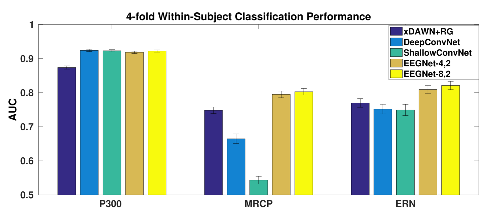
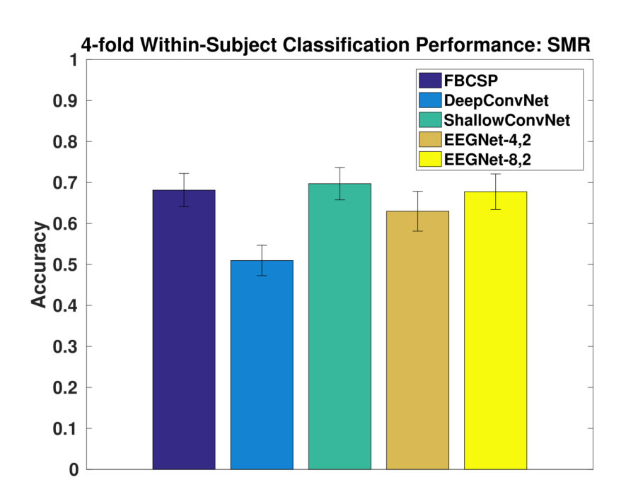
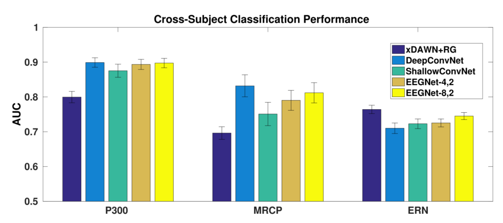
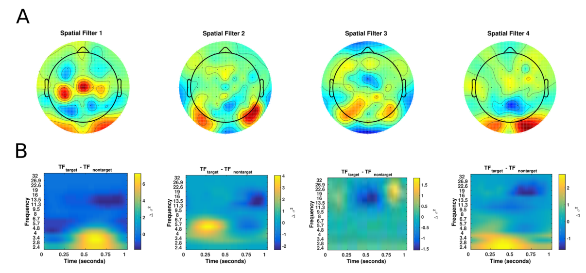
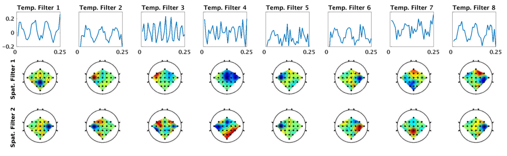
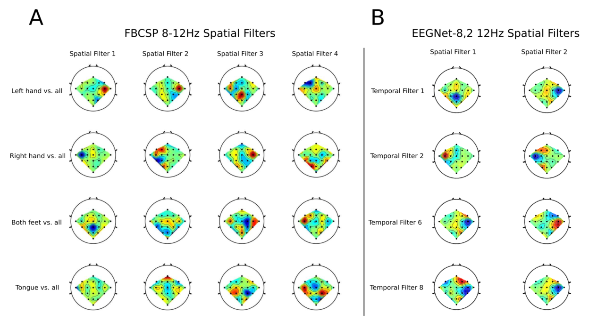
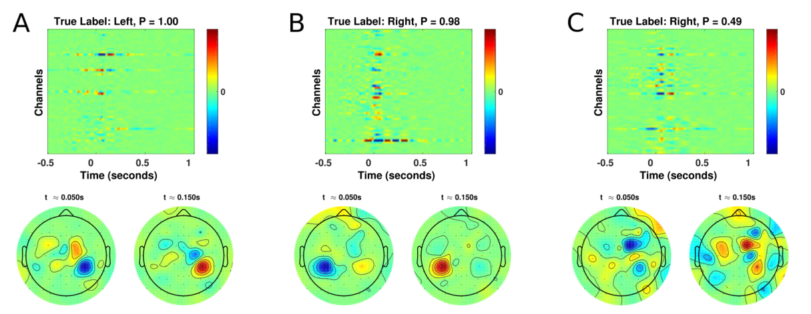
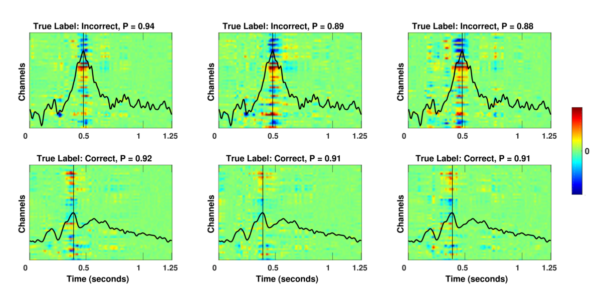

# EEGNet

[这篇论文的来源](https://www.researchgate.net/publication/310953136_EEGNet_A_Compact_Convolutional_Network_for_EEG-based_Brain-Computer_Interfaces)

**题目：** EEGNet:一个紧凑的卷积神经网络

## 1. 摘要

- 背景：
  - BCI使神经活动与计算机进行直接通信
  - 由于EEG控制信号的不同，设计不同的特征提取器和分类器
  - CNN虽然已经很好了，但是只能应用于单个BCI范式，尚不能推广
- 目的：
  - 来设计一个单一的CNN架构来准确分类来自不同BCI范式的EEG信号
  - (而且尽可能紧凑，这个紧凑什么意思呢？体现在模型中的参数数量上)
- 模型：
  - EEGNet：基于EEG的BCI紧凑型卷积神经网络
- 构建：
  - 引入了深度卷积和可分离卷积来构建特定于脑电的模型
  - 模型封装了脑电特征提取概念
- 目前最先进的四种BCI范式的方法：
  - P300视觉诱发电位
  - 错误相关负性反应(ERN)
  - 运动相关皮质电位(MRCP)
  - 感觉运动节律(SMR)
- EEGNet和上面四种BCI范式比较结果：
  - 训练数据有限时，EEGNet的跨范式泛化效果较好，性能高
  - EEGNet有效的推广到ERP和基于震荡的bci
- 通过三种不同的方法来可视化训练过的EEGNet模型
- 意义：
  - EEGNet足够健壮
  - 可以在一系列BCI任务中学习各种可解释特征

## 2. 背景介绍

 ### 2.1. 脑机接口传统应用

- 在医学应用于人工假肢等方向
- 新兴：
  - 通过EEG的无创方法为健康用户提供帮助
- CNN的强大使得逐渐替代人工特征提取
  - 但是之前的研究只是集中在单个BCI任务的分类，对特定任务设计特定的网络架构
  - 训练网络的数据量大小也会导致差异

### 2.2. BCI的五个处理阶段

- 数据收集阶段，记录神经数据(通常使用公开数据或者实验室的数据)
- 信号处理阶段，对数据进行预处理(我们目前从这里开始)
- 特征提取阶段，从神经数据中提取有用信息
- 分类阶段，根据数据解决策略分类(EEGNet就是帮助我们进行分类)
- 反馈阶段，将决策的结果反馈给用户

### 2.3. EEGNet

在前面的基础上，我们提出了EEGNet

- 一个紧凑的CNN，用于分类和解释两个基于eeg的bci
- 引入了深度卷积和可分离卷积的使用，来构建一个特定的脑电图网络
  - 该网络封装了几个著名的脑电图特征提取概念(如最佳空间滤波和滤波器库构建)
- 减少了可训练参数拟合的数量

### 2.4. 研究

- 评估EEGNet对四种不同BCI范式的脑电图数据的通用性
- 每个数据集合包含不同数量的数据，探索EEGNet对各种大小的训练数据的有效性

### 2.5. 研究结果

- 训练数据有限时，EEGNet能取得更好的性能
- EEGNet可以有效的跨所有测试范例进行泛化
- EEGNet的表现于特定于范式的EEG CNN模型一样好，拟合参数少了两个数量级
  - 表明模型参数的使用更加有效
- 通过特征可视化和模型消融分析
  - 可以从EEGNet模型中提取神经生理学可解释的特征
    - 这点的重要性：
    - 因为cnn，尽管具有鲁棒性和自动特征提取，但是它们会产生不知道如何解释的特征

## 3. 数据和方法

### 3.1. 数据简述

**主要是验证CNN模型的四个数据集的简述**

bci分类：

- 事件相关型
- 震荡型

事件相关型(ERP)：

- 事件相关电位(ERP)bci旨在检测已知的、时间锁定的外部刺激引起的高振幅和低频脑电图反应
- 它们在各受试者之间都是稳健的，包含良好的刻板印象波形，使ERP时间进程能通过机器学习有效的建模

震荡型(Oscillatory)：

- 利用特定的脑电图频段的信号功率进行外部控制，通常为异步
- 当震荡信号被外部刺激定时锁定时，它们可以通过时间相关谱摄动分析来表示
- 震荡型bci比较难训练，通常是由于较低的信噪比(SNR)以及来自不同受试者造成较大差异

|范例|功能类型|带通滤波器|# of Subjects|实验/Subject|# of Classes|Class不平衡？|
|--|--|--|--|--|--|--|
|P300|ERP|1-40Hz|15|~2000|2|Yes,~5.6:1|
|ERN|ERP|1-40Hz|26|340|2|Yes,~3.4:1|
|MRCP|ERP/Oscillatory|0.1-40Hz|13|~1100|2|No|
|SMR|Oscillatory|4-40Hz|9|288|4|NO|
表1：本研究的数据收集汇总

- class不平衡
  - 例如2:1的概率意味着类失衡，1类数据占总数居的2/3，2类数据占总数居的1/3
  - 对于P300和ERN数据集，class失衡与subject相关
    - 因此，odds被认为是所有subject的平均class失衡

#### 3.1.1. 数据集1：P300事件相关电位

数据集说明：

- 18名参与者自愿参加RSVP BCI研究
- 研究人员以2hz的频率向参与者展示自然风景的图片
  - 图片中可能会出现车辆或人(目标)，可能不出现车辆或人(非目标)
  - 当目标图像出现时，参与者被要求用惯用手按下按钮
  - 目标/非目标比率为20%/80%
- 由于过多的伪影/噪声的存在，3名被试者的数据被排除，只剩下15名被试者的数据
  - 他们有9名男性，14名右撇子，年龄18-57(平均39.5)
  - EEG记录采用BioSemi Active Two系统以512hz的数字采样方式，从64个头皮电极以10-10蒙太奇的方式排列
  - 离线数据参考左右耳垂的平均值
  - 使用EEGLAB实现的FIR滤波器进行数字带通滤波到1-40Hz，下采样到128hz
  - 在刺激开始后[0,1]s提取目标和非目标条件下的EEG trials
  - 应用于两分类

数据集描述：

- P300事件相关电位是一种对新奇视觉刺激的刻板神经反应
- 它通常是由视觉古怪范式引起的
  - 参与者被展示出重复的非目标视觉刺激
  - 这些非目标视觉刺激以固定的呈现速率(如1hz)穿插在不频繁的目标刺激中
- 在顶叶皮层上观察到的P300波形是刺激开始后大约300毫秒观察到的电活动的一个大的正偏转
  - 偏转强度与目标刺激的频率成反比(出现频率越低，偏转越强烈)
- P300ERp是EEG观察到的最强的神经信号之一
- 当图像呈现速率增加到2hz或更高，被称为快速串行视觉呈现(REVP)

#### 3.1.2. 数据集2：反馈错误相关的消极性(ERN)

数据集说明：

- 26名健康的参与者(16名用于训练，10名用于测试)参加一项P300拼写任务
  - 该任务是使用一组随机闪烁的字母序列，排列在6*6网格中，用来引出P300的反应
  - 挑战者的目标是确定P300拼写者的反馈是正确的还是错误的
- 最初是在600hz下使用56个被动Ag/AgCl EEG传感器记录的，随后使用扩展的10-20系统放置电极
- 先使用EEGLAB中的FIR滤波器对EEG数据进行带通滤波到1-40Hz，下采样到128Hz
- 在[0, 1.25]s的反馈呈现后提取正确和错误反馈的EEG实验，作为两分类特征

数据集描述：

- 它是在受试者的环境或任务中发生错误或不寻常事件后对EEG造成的扰动
- 它们可以在各种任务中观察到(时间间隔产生范式和强制选择范式)
- 我们关注ERN，这是一种EEG振幅扰动后，感知到由脑电接口产生的错误反馈
  - 反馈ERN的特征是：在视觉反馈后，大约350ms为负误差分量，大约500ms为正误差分量
- 反馈ERN的检测提供了一种机制来推断，并可能实时纠正BCI的错误输出
- 已被证明可提高在线应用中P300拼写器的性能

#### 3.1.3. 数据集3：运动相关皮层电位(MRCP)

数据集说明：

- 13名受试者使用左食指、左中指、右食指和右中值进行自定步调的手指运动
- 使用256通道BioSemi Active II系统以1024Hz记录数据
- 使用PREP管道对EEG数据进行处理(由于存在大量信号噪声)
- 数据参考连接乳突，使用EEGLAB的FIR滤波器进行带通滤波，到0.1Hz到40Hz之间，下采样到128Hz
  - 再进一步向下采样通道空间到标准的64通道生物半蒙太奇
- 将每只手的食指和中指块进行组合，对起源于左手或右手的5种运动进行二分类

数据集描述：

- 神经活动会包含ERP和震荡成分
  - 运动相关皮层电位就是这样
  - 它可以由手脚的随意运动引起，可以通过脑电图沿着手脚运动对策的中央和中线电极观察到
- MRCP可以看到
  - 在运动开始前
    - 缓慢的 0-5Hz 准备就绪
    - 潜在的和 10-12Hz 频带中的早期失步
  - 在运动开始
    - 慢运动电位
  - 运动结束后
    - 运动执行后约 1 秒，20-30Hz 活动的延迟同步
- MRCP 以前曾被用于为健康和身体残疾的患者开发运动控制 BCI

#### 3.1.4. 数据集4：感觉运动节律(SMR)

数据集说明：

- 数据来自BCI Competition IV数据集
- 由9名受试者记录的左右手、脚和舌头的四类运动想象组成
- 最初使用22个Ag/AgCl电极记录EEG数据
  - 以250Hz采样，并在0.5-100Hz之间进行带通滤波，降采样到128Hz
- 在线索出现后的[0.5, 2.5]秒记录数据

数据集描述：

- 基于振荡的 BCI 的一个常见控制信号是感觉运动节律
- 其中mu(8-12Hz)和beta(18-26Hz)频带在与实际或运动想象对侧的感觉运动皮层上同步
- SMR和MRCP的震荡分量非常相似
- SMR在受试者之间和受试者内部很弱，变化很大，需要长时间校准

### 3.2. 分类方法

- 描述了EEGNet模型以及在模型比较中使用的其他BCI模型

#### 3.2.1. EEGNet：紧凑的CNN架构

**在这里，首先介绍EEGNet**这是一种基于EEG的BCI的紧凑CNN架构

1. 可以应用与多种不同的BCI范式
2. 可以使用非常优先的数据进行训练(对数据量小的数据集友好)
3. 可以产生神经生理学上可以解释的特征(便于理解)

**EEGNet模型：**

EEGNet模型可视化

图1：EEGNet架构的整体可视化

- 该网络从时间卷积(第二列)开始学习频率滤波器
- 使用深度卷积(中间列)分别连接到每个特征地图，学习频率特定的空间滤波器
- 可分离卷积(第四列)是深度卷积的组合，它分别学习每个特征映射的时间摘要，然后住店卷积
  - 它学习如何将特征映射最佳地混合在一起

**数据以及设定的环境：**

- 模型用于以128Hz采样率采集的EEG试验，具有C通道和T时间样本
- 使用Adam优化器拟合模型，使用默认参数，最小化分类交叉熵损失函数
- 运行500次训练迭代，并执行验证停止，保存产生最低验证集损失的模型权重
- 所有模型均在NVIDIA Quadro M6000 GPU上进行训练，CUDA 9 和cuDNN v7版本的tensorflow，使用Keras API

|Block|Layer|#filter|size|#params|Output|Activation|Options|
|--|--|--|--|--|--|--|--|
|1|Input||||(C,T)|||
||reshape||||(1,C,T)|||
||Conv2D|F1|(1,64)|64*F1|(F1,C,T)|Linear|mode=same|
||BatchNorm||2*F1|(f1,C,T)||||
||DepthwiseConv2d|D* F1|(C,1)|C* D* F1|(D*F1,1,T)|Linear|model=valid,depth=D,max norm=1|
||BatchNorm|||2* D* F1|(D*F1,1,T)|||
||Activation||||(D* F1,1,T)|ELU||
||AveragePool2D||(1,4)||(D*F1,1,T//4)|||
||Dropout*||||(D*F1,1,T//4)||p=0.25 or p=0.5|
|2|SeparableConv2D|F2|(1,16)|16* D* F1+F2*(D*F1)|(F1,1,T//4)|Linear|model=same|
||BatchNorm|||2*F2|(F2,1,T//4)|||
||Activation||||(F2,1,T//4)|ELU||
||AveragePool2D||(1,8)||(F2,1,T//32)|||
||Dropout*||||(F2,1,T//32)||p=0.25 or p=0.5|
||Flatten||||(F2,1,T//32)|||
|Classifier|Dense|N*(F2*T//32)|||N|Softmax|max norm=0.25|
表2：EEGNet架构

***EEGNet参数***

- C=通道数量
- T=时间点数量
- F1=时间过滤器数量
- D=深度乘数(空间过滤器数量)
- F2=逐点过滤器数量
- N=类数量
- 对于Dropout层
  - 使用p=0.5表示主题内分类
  - 使用p=0.25表示跨主题分类

***EEGNet架构***

- Block1(按顺序执行两个卷积步骤)
  - 步骤1
    - 拟合大小为(1,64)的F1 2D卷积滤波器，滤波器的长度为数据采样率的一半(这里是128Hz)
    - 输出不同带通频率下EEG信号的F1特征图
    - 将时间内核的长度设置为采样率的一半，可以捕获2Hz以上的频率信息
  - 步骤2
    - 使用大小为(C,1)的深度卷积来学习空间滤波器
      - 深度卷积的好处：可以减少训练参数的数量以训练(因为这些卷积没有完全连接到以前的所有特征图)
      - 当应用于特定于EEG的应用程序时，这样可以提供一种直接 方法来学习每个时间滤波器的空间滤波器，能够有效的提取特定于频率的空间滤波器
    - 深度参数D控制每个特征地图要学习的空间过滤器的数量
  - 将两个卷积保持为线性(因为使用线性比非线性性能提高显著)
  - 在应用质数线性单元(ELU)非线性之前，沿特征映射维度应用批量归一化
  - 为了规范化建模，使用Dropout
  - 因为训练集的规模很大
    - 使用大小为(1,4)的平均池层将信号的采样率降到32Hz
    - 通过对每个空间滤波器的权重使用1的最大范数约束来正则化每个空间滤波器$\left \| \omega  \right \| ^2 <1$
- Block2
  - 步骤1：学习每个特征图的500ms"摘要"，然后组合输出
  - 步骤2：大小为(1,8)的平均池化层用于降维
  - 使用可分离卷积(大小为(1,16),表示32Hz下500ms的EEG活动)
  - F2(1,1)逐点卷积
  - 当用于EEG特定应用时，该操作将学习如何及时总结单个特征图(深度卷积)与如何优化组合特征图(逐点卷积)分离开
    - 这种操作对于EEG信号特别有用，因为不同的特征图可能表示不同时间尺度信息的数据
  - 可分离卷积的好处
    - 减少要拟合的参数数量
    - 通过首先学习一个单独汇总每个特征映射的核，然后以最佳方式合并输出，显示解耦特征映射内部和之间的关系
- Classification block
  - 特征直接传递给具有N个单位的softmax分类
    - N是数据中的类数
  - 省略了softmax分层之前使用密集层进行特征聚合，以减少模型种自由参数的数量

***研究过程***

- 通过改变滤波器数量F1和每个时间滤波器的空间滤波器数量D来研究EEGNet架构的集中不同配置
- 设置F2=D*F1(来自Block1的时间滤波器以及相关的空间滤波器)
  - F2< D*F1表示学习的特征比输入的少
  - F2> D*F1表示学习的特征映射比输入的多
- 使用EEGNet-F1,D 来表示要学习的时间和空间滤波器的数量
  - 例如:EEGNet-4,2表示学习4个时间滤波器，每个时间滤波器学习两个空间滤波器

||Trial Length(sec)|DeepConvNet|ShallowConvNet|EEGNet-4,2|EEGNet-8,2|
|--|--|--|--|--|--|
|P300|1|174127|104002|1066|2258|
|ERN|1.25|169927|91602|1082|2290|
|MECP|1.5|175727|104722|1098|2322|
|SMR*|2|152219|40644|796|1716|
表3：所有基于CNN的模型的每个模型和每个数据集的可训练参数数量

- 在所有数据集中EEGNet模型比DeepConvNet和ShallowConvNet的数量级要小很多

#### 3.2.2. EEGNet与现有CNN方法的比较

- 将EEGNet与DeepConvNet和ShallowConvNet模型进行比较
  - DeepConvNet体系结构包括
    - 五个卷积层
    - 一个softmax层用于分类
  - ShallowConvNet体系结构包括
    - 两个卷积层(时间,空间)
    - 一个平方非线性层(f(x)=x2)
    - 一个平均池
    - 一个对数非线性层(f(x)=log(x))
  - DeepConvNet体系结构是一种通用体系结构，不得局限于特定的功能
  - ShallowConvNet体系结构是专门用于震荡信号分类的(所以可能会无法很好的处理基于ERP的分类任务)

#### 3.2.3. 与传统方法比较

***将EEGNet的性能和每个范例中性能最好的传统方法进行比较***

**对于基于ERP的数据分析**
传统方法是在Kaggle BCI竞赛中获胜的方法

- 该方法使用了xDA-WN空间过滤器、黎曼几何、通道子集选择和L1特征正则化(使用xDA WN+RG代替)
- 该方法的五个步骤：
  1. 使用ERP模板串联方法，训练两组5个xDA WN空间过滤器，一组用于二进制分类任务的每个类
  2. 通过反向消除进行EEG电极选择，保留35个最相关的通道
  3. 使用对数欧几里得度量将协方差矩阵投影到切线空间上
  4. 使用0.5的L1比率执行特征归一化，表示L1和L2惩罚的权重相等
     - L1惩罚鼓励参数的绝对值之和变小
     - L2惩罚鼓励参数的平方和变小
  5. 使用弹性净回归进行分类
- 在所有比较(P300、ERN、MRCP)中使用相同的xDA WN+RG模型参数
  - 初始EEG通道数不一样(ERN设置为56,P300和MRCP设置为64)
- 仅将使用该方法的单个模型 与 相同训练集和测试集的单个EEGNet模型进行比较

**对于基于震荡的SMR分类**
传统方法是一对多(OVR)滤波器组公共空间模式(FBCSP)算法

- 该算法的五个步骤
  1. 带通滤波器将EEG信号按4Hz的步长分成9个不重叠的滤波器组(从4Hz开始)
  2. 使用OVR分类，就要求为所有成队的OVR组合训练一个分类器
     - 使用自协方差收缩方法为每个滤波器组在训练数据上训练2个CSP滤波器对(共有4个滤波器)
       - 这会为每个实验和每个OVR组合提供36个特征(9个滤波器组*4个CSP滤波器)
  3. 为每个OVR组合训练一个弹性净logistic回归分类器(假设弹性净惩罚$\alpha$=0.95)
  4. 通过在已建立的验证集上评估经过训练的分类器，找到弹性净逻辑回归的最佳$\lambda$值，从而最大限度提高验证机的准确率(每个实验的多类标签是在4个OVR分类器中产生最高概率的分类器)
  5. 使用步骤4获得的$\lambda$值，将经过训练的分类器应用于测试集

### 3.3. 数据分析

***两组分析的分类结果***

- 受试者内分析
  - 使用一部分受试者数据来训练模型
  - 受试者内部分析会比跨受试者模型表现好
- 跨受试者分析
  - 使用其它受试者的数据来训练模型

#### 3.3.1. 受试者内部分析

使用四重分块交叉验证，其中一块作为训练集，一块作为验证集，最后一块作为测试集

- 使用重复测量方差分析(ANOVA)进行统计测试
- 将分类结果(P300、MRCP、ERN的AUC和SMR的分类经度)建模为相应变量
- 以受试者数量和分类器类型为因素

#### 3.3.2. 跨受试者分析

**对P300和MRCP中的交叉受试者分析**
随机选择4名受试者作为验证集，一名受试者作为测试集，其余所有受试者作为训练集

- 该过程重复了30次，产生了30种不同的折叠

**对于ERN数据集**
使用相同的步骤

- 使用原始Kaggle比赛中的10名受试者作为每个折叠的测试集
- 使用单向方差分析进行统计测试，使用分类器类型作为因子

**对于SMR数据集**
数据划分如下：

- 每个受试者，随机选择其他五个受试者的训练数据作为训练集，其余三个受试者的训练数据作为验证集
- 这个过程，每个受试者重复10次，形成90个不同的褶皱，计算90倍以上分类性能的平均值和标准误差
- 这里从来不使用受试者的训练数据，强制执行完全跨受试者的分类分析

#### 3.3.3. 训练模型

- 无论是受试者内还是跨受试者训练模型，只要数据不平衡，就对损失函数应用类别权重
- 类别权重与训练数据中的比例成反比(可以设置为1)
  - 例：
  - P300中非目标:目标 = 5.6:1 ，而在此处设置为1:6
  - (这个仅适应于P300和ERN数据集，因为它才会有这么严重的不平衡)
- 对于SMR分析，将长度设置为32个样本长度，因为数据是4Hz高通的

### 3.4. EEGNet功能可解释性

深度神经网络的特征可解释性方法的开发已经是一个很活跃的领域了，为了确保分类性能由相关特征驱动，而不是数据中的噪声或伪影。提出了三种不同的方法来理解EEGNet派生的功能：

1. 汇总隐藏单元激活的平均输出
   - 侧重汇总用户指定的层上的隐藏单元的激活
   - 总结代表深度卷积(EEGNet中的空间滤波操作)的数据的隐藏单元激活
     - 由于空间滤波器直接绑定到特定的时间滤波器，他们为窄带频率活动的空间局部化提供了额外的洞察力
   - 使用Morlet小波计算不同类别之间的平均时频表示的差异来总结空间过滤的数据
2. 可视化卷积核权重
   - 侧重于直接可视化和解释模型中的卷积核权值
   - 由于EEGNet限制卷积的连通性(使用深度可分离的卷积),所以可以将时间卷积解释为窄带频率滤波器，而将深度卷积解释为频率特定的空间滤波器
     - 一般(由于任意两层间的交叉滤波映射连通性，解释卷积核权重是非常困难的)
3. 计算分类决策上的单词实验特征相关度
   - 侧重在单次实验的基础上计算单个特征对结果分类决策的相关性
   - 相关性的正值表示支持结果的证据，负值表示反对结果的证据
   - 在分析中
     - 使用DeepLIFT和重订标规则来计算单次实验EEG特性的相关性
     - DeepLIFT是一种基于梯度的相关性属性方法
       - 计算每个特征相对于参考输入的相关性，并且是类似于先前已经用于EEG分析的分层相关性传播的技术
     - 这种分析可以用来从高置信度预测和低置信度预测中阐明特征相关性，可以用来确认所学习的相关特征是可解释的，而不是噪声或伪影特征

图2：每个模型的P300、ERN和MRCP数据集的4倍对象内分类性能，所有对象和所有对象的平均值

- 误差条表示平均值的2个标准误差
- 分析(p<0.05)：
  - P300数据集的所有CNN模型之间的差异很小
  - MRCP数据集上有显著差异，两个EEGNet模型表现很好
  - ERN数据集虽然差异不太大，但是两个EEGNet模型的表现也是比其他模型要好一些的

## 4. 结果

- 展示了学科内和跨学科分类表现的结果，以及特征可解释性分析的结果

### 4.1. 受试者内部分类

比较了基于CNN的参考算法(DeepConvNet和ShallowConvNet)和传统方法(用于P300/MRCP/ERN的XDA WN+RG和用于SMR的FBCSP)与EEGNet-4,2和EEGNet-8,2的性能。

- 对于P300,MRCP和ERN数据集的主题内四重交叉验证结果如图二所示
  - 在所有范例中,EEGNet-4,2和EEGNet-8,2之间没有统计上的显著差距(p>0.05)
    - 模型复杂度的增加并没有在统计上改善分类性能
  - 对于P300数据集,所有基于CNN的模型都优于XDA WN+RG(p<0.05)，并且他们之间的差距几乎没有
  - 对于ERN数据集,EEGNet4,2和EEGNet-8,2的性能优于DeepConvNet,ShallowConvNet和XDA WN+RG(p<0.05)
  - 对于MRCP数据集,这些方法的结果表现差异巨大，EEGNet4,2和EEGNet-8,2的性能**明显**优于DeepConvNet,ShallowConvNet和XDA WN+RG(p<0.05)

图3：每个模型的SMR数据集的四倍受试者内分类性能，所有折叠和所有受试者的平均值

- 误差条表示平均的2个标准误差

- SMR数据集的四重交叉验证结果
  - ShallowConvNet和FBCSP的性能相近，EEGNet-8,2与他们相差不大
  - DEEPConvNet性能明显较低

### 4.2. 跨受试者

- 与受试者内的分类类似，跨受试者分类的EEGNet-8,2与EEGNet-4,2之间的差异很小
- 对于P300数据集，所有基于CNN的模型都优于XDA WN+RG(p<0.05)，并且他们之间的差距不明显
- 对于MRCP数据集，ShallowConvNet的性能明显较差，仅比XDA WN+RG高一些
- 对于ERN数据集，XDA WN+RG的性能明显优于所有的CNN模型

图4：每个模型的P300、ERN和MRCP数据集的跨被试分类性能，平均为30倍

图5：每个模型的SMR的跨主题分类性能，所有折页和所有主题的平均值

- 所有基于CNN的模型表现相似，比FBCSP略高

### 4.3. EEGNet特征描述

举例说明了三种不同的方法来表征EEGNet学习的特征

1. 汇总隐藏单元激活的平均输出
2. 可视化卷积核权重
3. 计算分类决策中的单词尝试特征关联度

在P300数据集上说明了跨主题训练的EEGNet-4,1模型的方法1

- 选择分析P300数据集中的过滤器，因为多个神经生理事件同时发生
  - 参与者在目标图像出现时，用手按下按钮
  - 靶向实验包括
    - P300事件相关电位
    - 对侧运动皮质由于按钮按下产生的$\alpha / \beta$去同步化
  - 我们关注于EEGNet架构是否能够分离出这些事件

图6：P300数据集中一个特定跨被试折叠的EEGNet-4,1模型配置派生的功能的可视化

- A：每个空间过滤器的空间拓扑图
- B：每个单独滤波器的目标和非目标试验之间的平均小波时频差
- 显示了所有靶标试验和非靶标试验之间的四个滤波器的空间地形以及使用Morlet小波计算的平均小波频差
- 这里有四种截然不同的过滤器
  - 滤波器1的时频分析显示，在大约500ms之后，低频功率增加，随后alpha频率下去同步
    - 由于大多数受试者都是右撇子，所以左侧运动皮质活动显著
  - 过滤器2的时频分析显示了显著的theta-beta关系
  - 滤波器4的时频似乎与P300一致，在350ms增加了低频功率

|Filters Removed|Test Set AUC|
|--|--|
|(1)|0.8866|
|(2)|0.9076|
|(3)|0.8910|
|(4)|0.8747|
|(1,2)|0.8875|
|(1,3)|0.8593|
|(1,4)|0.8325|
|(2,3)|0.8923|
|(2,4)|0.8721|
|(3,4)|0.8206|
|(1,2,3)|0.8637|
|(1,2,4)|0.8202|
|(1,3,4)|0.7108|
|(2,3,4)|0.7970|
|None|0.9054|
表4：跨学科训练的EEGNet-4,1模型在从模型中移除某些过滤器时的性能

- 通过该模型预测P300数据集的一个随机选择的折叠的测试集
- 移除过滤器数量越多，下降幅度越大

图7：从SMR数据集的第三个受试者内训练的EEGNet-8,2模型派生的特征的可视化

- 每一列显示了0.25秒窗口的学习时间核及相关的两个空间过滤器
- 我们估计每个时间过滤器的频率是观察到的周期数的四倍
  - 观察到大约12Hz的慢频活动(过滤1、2、6、8，在0.25秒窗口显示三个周期)
  - 大约32Hz的高频活动(过滤器3，显示8个周期)

图8：对于每个OVR类别组合(A),FBCSP在8-12Hz滤波器组中学习的4个空间滤波器与由EEGNet-8,2(B)针对4个捕捉SMR数据集受试者3的12Hz频率活动的时间过滤器(时间过滤器1、2、6、8)学习的空间滤波器的比较

- 有些过滤器跨模型是强正相关的(用X-Y表示相对位置)
  - EEGNet-8,2的1-1过滤器和FBCSP的3-1过滤器(p=0.93)
  - EEGNet-8,2的2-1过滤器和FBCSP的3-4过滤器p=0.83
- 有些过滤器跨模型是强负相关的
  - EEGNet-8,2的3-1与FBCSP的1-1
- 表明通过使用深度卷积，EEGNet能够以类似于FBCSP的方式学习特定于频带的空间滤波器

图9：使用DeepLIFT的跨对象训练的EEGNet-8,2模型的单试验EEG特征相关性

- 用于MRCP数据集的三个不同测试试验
  - A：对左指运动的高置信度、正确预测
  - B：对右指运动的高置信度、正确预测
  - C：对左指运动的低置信度、错误预测
- 图中包含
  - 标题：真实的类别标签和该标签的预测概率
  - 两个时间点的相关性的空间拓扑图(在按下按钮后大约50ms和150ms)
- 高置信度实验分别显示了左侧和右侧按钮按压对应的对策运动皮质的正确相关性
- 低置信度实验，可以看到相关性更加混合和广泛的分布，没有明确的运动皮质的空间定位
- 就是正确的他的信号分布集中，位置正确

图10：使用DeepLIFT对ERN数据集的一个测试对象使用DeepLIFT的跨对象训练EEGNet-4,2模型的残次实验EEG特征相关性

- 图中包括
  - 第一行三个正确预测的不正确反馈实验的特征相关性及其预测概率P
  - 第二行三个正确预测的正确反馈实验的特征相关性及其预测概率P
- 图的解释
  - 黑线表示通道Cz处于计算的平均ERP，用于不正确的反馈实验和正确的反馈实验
  - 细垂直线表示平均事件相关电位波形的正峰值
- 特征相关性与每个实验的平均ERP波形的正峰值强烈重合
  - 这表明网络已经将分支正电位作为ERN分类的相关特征
- 正确反馈实验的正峰值出现时机稍早
  - 正确反馈实验的正峰值大约在325ms出现
  - 不正确反馈实验的正峰值大约出现在475ms

## 5. 总结

**EEGNet:** 它是用于基于EEG的BCI，可以在有限数据存在的情况下对不同的BCI范例进行泛化，并能产生可解释的特征

用到的数据集

- P300视觉诱发电位
- 错误相关负波(ERN)
- 运动相关皮质电位(MRCP)
- 感觉运动节律(SMR)

**操作:**
对EEGNet进行了针对ERP和基于震荡的BCI的最先进方法的评估(这是第一个对多个BCI数据集使用单一网络架构的工作，而且每个数据集的特征和数据集大小都不咋相同)

**创新:**
引入了深度卷积核可分离卷积用于脑电信号分类，表明它们可以用来构建封装了脑电特征提取概念的特定脑电信号的模型

**网络科学的证明:**
通过使用特征可视化和消融分析，表明可以从EEGNet模型中提取神经生理学上可解释的特征，进一步验证和证明网络性能不是由数据中的噪声或伪影信号驱动的

**特别重要的发现:** 它是理解CNN模型结构的有效性和稳健性的相关组件，不仅对于EEG，还对于一般的CNN架构

**CNN的不足:** CNN的可以自动的从原始数据中提取复杂的特征表示的能力，这是它的优点，但也带来了致命弱点:在理解这些特征的含义并生成可解释的模型是很困难的(当CNN被用作处理EEG数据时更加明显，很容易被噪声和伪影所破坏)。

**EEGNet显威**
研究中展示了三种不同的可视化EEGNet学习的特征的方法

- 在P300数据集上分析空间滤波输出，通过实验平均
- 可视化SMR数据集上的卷积核权重，并将他们与FBCSP学习的权重进行比较
- 对MRCP和SMR数据集进行单次实验性分析

对于ERN数据集，将单词实验特征相关性与平均ERP进行比较，并表明相关特征与正确和错误反馈实验的正潜力峰值一致(这与分类器性能正相关)

进行了特征消融研究，用来了解分类决定对P300数据集上特定特征的存在或不存在的影响

在每一项分析中，EEGNet能够提取通常与一致神经现象相对应的可解释特征

**SMR数据集**
EEGNet学习的时间核心的空间滤波器与FBCSP在8-12Hz的滤波器组中学习空间滤波器显著相关

重要点：

- CSP(最优方差分离)
- EEGNet(最小交叉熵损失)

虽然他们的优化标准不一样，但是许多过滤器实际上是一样的，这表明EEGNet正在学习与FBCSP相似的特征表示，这种分析得益于EEGNet使用深度卷积将空间过滤器直接绑定到时间过滤器，这是该模型的独到之处

**DeepConvNet和EEGNet**
他们在所有跨被试分析中的分类性能相似，而且前者几乎所有被试内分析中的分类性能比后者低(P300除外)

可能的原因：训练模型的训练数据量，在跨被试中，训练集大小约为被试内分析的10-15倍，这表明与EEGNet相比，DeepConvNet的数据密集度更高(这是因为DeepConvNet的模型比EEGNet的模型大了两个数量级)

DeepConvNet开发者最初的报告指出他们需要一种训练数据增强策略来在SMR数据集上获得更好的分类性能，而EEGNet在所有测试的数据集上表现良好，不需要数据扩充，模型在实践中更易于使用

**EEGNet提取了ShallowConvNet和DeepConvNet的优点**
在内部和跨对象分析中，ShallowConvNet在ERP BCI数据集上的表现比震荡BCI(SMR)数据集上表现差，而DeepConvNet恰恰相反

- ShallowConvNet架构是专门为提取对数带宽功率特征而设计的
  - 在主要特征是信号幅度的情况下，ShallowConvNet的性能会受到影响
- DeepConvNet架构不是为提取频率特征而设计的
- EEGNet在SMR和ERP分类上的表现都很好，表明EEGNet足够健壮，可以在一系列BCI任务重学习各种特征

**意想不到**
ShallowConvNet在被试内MRCP分类上性能很差有些意想不到

- MRCP和SMR在神经反应上相似，而且ShallowConvNet在SMR上表现良好，但是在MRCP上表现差
- 在训练数据量上
  - 被试内的MRCP分类有大约700个训练数据，平均分配给左右手指动作
  - SMR数据集只有192个训练数据，平均分配给四个类别
- 在P300和ERN上ShallowConvNet的性能偏差不大，而且ERN上仅有170个训练数据，但是它的表现还很好

***用于EEG的深度学习模型通常采用三种输入风格***

1. 所有可用通道的EEG信号
2. 所有可用通道的变换后EEG信号(通常是时频分解)
3. 通道子集的转化EEG信号

使用(2)的模型通常会看到数据维度的显著增加，因此需要更多的数据或更多的模型正则化来学习有效的特征表示，这引入了更多必须学习的超参数，增加了由于超参数错误指定导致的模型性能的潜在可变性。

属于 (3) 的模型通常需要先验知识来选择要选择的通道。

- 如，有的模型使用通道Cz、C3和C4的时频分解作为运动图像分类任务的输入
- 因为神经对运动动作的反应在这些通道上观察到的最强烈，很容易通过时频分析观察到
- 而且只使用三个通道，减少了数据在维度上的增加
- 优点：预先知道感兴趣的特征，该方法工作很好
- 缺点：不能保证该方法在哪些通道上没有观察到特征的其他应用中工作的很好，从而限制了该方法的整体效用

属于(1)的模型，在输入维度和通过提供所有可用通道来发现相关特征的灵活性之间提供了最佳的折衷

## 6. 附录

|Layer|#filters|size|#params|Activation|Options|
|--|--|--|--|--|--|
|Input||(C,T)||||
|Reshape||(1,C,T)||||
|Conv2D|25|(1,5)|150|Linear|model=valid,max norm=2|
|Conv2D|25|(C,5)|25*25*C+25|Linear|model=valid,max norm=2|
|BatchNorm|||2*25||epsiln=1e-05,momentum=0.1|
|Activation||||ELU||
|MaxPool2D||(1,2)||||
|Dropout|||||p=0.5|
|Conv2D|50|(1,5)|25*25*C+25|Linear|model=valid,max norm=2|
|BatchNorm|||2*25||epsiln=1e-05,momentum=0.1|
|Activation||||ELU||
|MaxPool2D||(1,2)||||
|Dropout|||||p=0.5|
|Conv2D|100|(1,5)|50*100*C+100|Linear|model=valid,max norm=2|
|BatchNorm|||2*100||epsiln=1e-05,momentum=0.1|
|Activation||||ELU||
|MaxPool2D||(1,2)||||
|Dropout|||||p=0.5|
|Conv2D|200|(1,5)|100*200*C+200|Linear|model=valid,max norm=2|
|BatchNorm|||2*200||epsiln=1e-05,momentum=0.1|
|Activation||||ELU||
|MaxPool2D||(1,2)||||
|Dropout|||||p=0.5|
|Flatten||||||
|Dense|N|||softmax|max norm=0.5|

表5：DeepConvNet架构，C=通道数，T=时间点数，N=类数

- 被设计为不限于特定特征类型的通用架构

|Layer|#filters|size|#params|Activation|Options|
|--|--|--|--|--|--|
|Input||(C,T)||||
|Reshape||(1,C,T)||||
|Conv2D|40|(1,13)|560|Linear|model=same,max norm=2|
|Conv2D|40|(C,1)|40*40*C|Linear|model=valid,max norm=2|
|BatchNorm|||2*40||epsiln=1e-05,momentum=0.1|
|Activation||||aquare||
|AveragePool2D||(1,35),stride(1,7)||||
|Activation||||log||
|Flatten||||||
|Dropout|||||p=0.5|
|Dense|N|||softmax|max norm=0.5|

表6：ShallowConvNet架构，C=通道数，T=时间点数，N=类数

- 被设计为震荡信号分类
- 平方激活函数和对数激活函数分别为f(X)=x2和f(X)=log(X)
- 为了数值稳定性，对LOG函数进行了剪裁，使得最小输入值是一个非常小的数字
